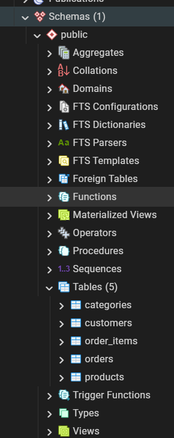
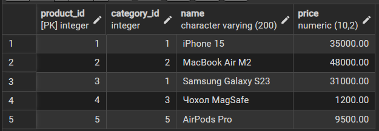

# Лабораторна робота №2
## Перетворення ER-діаграми у реляційну схему PostgreSQL

---

##  Мета роботи
Метою даної лабораторної роботи є перетворення розробленої ER-діаграми предметної області «Інтернет-магазин електроніки» у реляційну схему та її практична реалізація у СУБД PostgreSQL з використанням обмежень цілісності (constraints) та типів даних.

---

##  Опис проекту
База даних спроектована для автоматизації роботи магазину цифрової техніки. Система забезпечує:
- Зберігання ієрархії товарів (категорії → товари).
- Реєстрацію клієнтів з унікальними ідентифікаторами.
- Обробку замовлень та детальну фіксацію складу кожної покупки.

---

##  Реляційна схема бази даних
На основі концептуальної моделі було сформовано наступні реляційні відношення (первинні ключі виділені напівжирним):

- **Category** (**category_id**, name)
- **Customer** (**customer_id**, first_name, email)
- **Product** (**product_id**, *category_id*, name, price)
- **Order** (**order_id**, *customer_id*, order_date)
- **OrderItem** (**order_item_id**, *order_id*, *product_id*, quantity)

*Курсивом позначені зовнішні ключі (Foreign Keys).*

---

##  Користувацькі типи даних (ENUM)

Для підвищення цілісності даних у PostgreSQL використано перелічувані типи, що обмежують можливі значення для ключових полів бізнес-логіки:

- `order_status` : `new` , `paid` , `shipped` , `delivered` , `cancelled`
- `product_condition` : `new` , `refurbished` , `used`

---

##  Реалізація у PostgreSQL

Для забезпечення цілісності та валідації даних на рівні СУБД було використано:
- **SERIAL**: для автоматичної генерації унікальних ідентифікаторів.
- **FOREIGN KEY ... ON DELETE CASCADE**: для підтримання цілісності зв'язків (при видаленні категорії видаляються і її товари).
- **CHECK**: для гарантування, що ціна товару та кількість у замовленні не можуть бути нульовими або від'ємними.
- **UNIQUE**: для запобігання дублюванню електронних адрес клієнтів.

### SQL DDL-скрипт (Створення структури)

```sql
-- Створення таблиць
CREATE TABLE categories (
    category_id SERIAL PRIMARY KEY,
    name VARCHAR(100) NOT NULL
);

CREATE TABLE customers (
    customer_id SERIAL PRIMARY KEY,
    first_name VARCHAR(100) NOT NULL,
    email VARCHAR(150) UNIQUE NOT NULL
);

CREATE TABLE products (
    product_id SERIAL PRIMARY KEY,
    category_id INTEGER REFERENCES categories(category_id) ON DELETE CASCADE,
    name VARCHAR(200) NOT NULL,
    price NUMERIC(10, 2) NOT NULL CHECK (price > 0)
);

CREATE TABLE orders (
    order_id SERIAL PRIMARY KEY,
    customer_id INTEGER REFERENCES customers(customer_id) ON DELETE CASCADE,
    order_date TIMESTAMP DEFAULT CURRENT_TIMESTAMP
);

CREATE TABLE order_items (
    order_item_id SERIAL PRIMARY KEY,
    order_id INTEGER REFERENCES orders(order_id) ON DELETE CASCADE,
    product_id INTEGER REFERENCES products(product_id) ON DELETE CASCADE,
    quantity INTEGER NOT NULL CHECK (quantity > 0)
);
```

##  Тестування та верифікація схеми

Для підтвердження коректності реалізації реляційної моделі у PostgreSQL було проведено комплексне тестування, що включало перевірку структури, обмежень цілісності та наповнення бази тестовими даними.

### 1. Перевірка структури таблиць
Усі 5 таблиць та їхні зв'язки були успішно створені в СУБД. Перевірка проводилася через ієрархічне дерево об'єктів у pgAdmin 4.

* **Створені об'єкти**: `categories`, `customers`, `products`, `orders`, `order_items`.
* **Типи даних**: використано `SERIAL` для автоматичної індексації, `NUMERIC` для фінансових даних та `TIMESTAMP` для логування часу.



### 2. Наповнення та цілісність даних
Згідно з вимогами до лабораторної роботи, у кожну таблицю було додано **не менше 3 тестових записів**. Це дозволило перевірити роботу:
- **Primary Keys**: гарантування унікальності кожного запису.
- **Foreign Keys**: каскадне видалення та неможливість створення замовлення для неіснуючого клієнта.
- **CHECK Constraints**: автоматична валідація того, що ціна товару та його кількість у чеку є додатними числами.

**Приклад наповненої таблиці товарів (products):**



### 3. Результати тестування
- Усі SQL-скрипти (DDL та DML) виконуються без помилок
- Обмеження `UNIQUE` для поля `email` у таблиці клієнтів успішно запобігає дублюванню профілів
- Обмеження цілісності `ON DELETE CASCADE` коректно видаляє пов'язані позиції товарів при видаленні замовлення

## Висновки

У результаті виконання лабораторної роботи №2:
1. Концептуальна ER-діаграма була успішно перетворена у фізичну реляційну схему
2. Реалізовано структуру таблиць із чітко визначеними первинними та зовнішніми ключами для підтримання зв'язків між сутностями
3. Використано механізми `CHECK` та `NOT NULL` для забезпечення бізнес-логіки на рівні бази даних
4. Схема успішно протестована на реальних даних, що підтверджує її готовність до подальшої експлуатації у задачах OLTP та OLAP