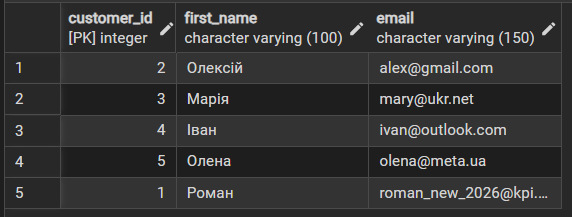
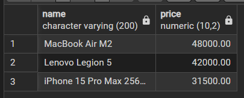
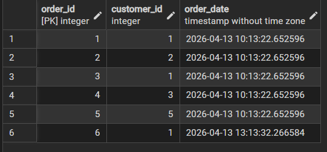
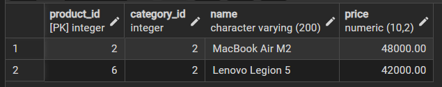
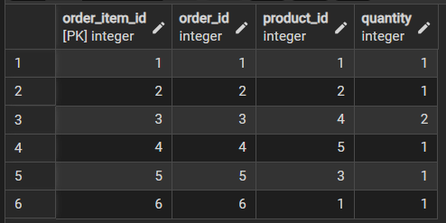

# Лабораторна робота №3
## Маніпулювання даними SQL (OLTP)
##  Мета роботи
Навчитися виконувати операції маніпулювання даними (DML) у середовищі PostgreSQL. Реалізувати типові сценарії Online Transaction Processing (OLTP): реєстрацію нових сутностей, коригування існуючих записів, вибірку за критеріями та безпечне видалення даних.

---

##  SQL-скрипт(и)

Нижче наведено перелік операцій, виконаних для маніпулювання даними у базі:

-- **1. Видалення застарілих даних**
-- Видалення клієнта, який не зробив жодного замовлення
```sql
DELETE FROM customers 
WHERE email = 'ivan@outlook.com';
```
-- Видалення товару, знятого з виробництва
```sql
DELETE FROM products 
WHERE name = 'Samsung Galaxy S23';
```
-- 2. Додавання нових даних (INSERT)
-- Реєстрація нового клієнта (Дмитро)
```sql
INSERT INTO customers (first_name, email)
VALUES ('Дмитро', 'dima_kpi@ukr.net');
```
-- Додавання нового товару до каталогу (Категорія "Ноутбуки")
```sql
INSERT INTO products (category_id, name, price)
VALUES (2, 'Lenovo Legion 5', 42000.00);
```
-- 3. Оновлення даних (UPDATE)
-- Проведення акції: знижка 10% на всі смартфони (category_id = 1)
```sql
UPDATE products
SET price = price * 0.9
WHERE category_id = 1;
```
-- Зміна контактних даних клієнта (оновлення пошти)
```sql
UPDATE customers
SET email = 'roman_new_2026@kpi.ua'
WHERE first_name = 'Роман';
```
-- 4. Вибірка та аналіз даних (SELECT)
-- Отримання списку всіх зареєстрованих клієнтів
```sql
SELECT * FROM customers;
```

-- Отримання списку товарів дорожчих за 30,000 грн (преміум-сегмент)
```sql
SELECT * FROM products
WHERE price > 30000;
```

-- Перегляд усіх замовлень, зроблених сьогодні
```sql
SELECT * FROM orders
WHERE order_date >= CURRENT_DATE;
```

-- Пошук товарів у конкретній категорії (наприклад, Ноутбуки)
```sql
SELECT * FROM products
WHERE category_id = 2;
```

-- Перегляд вмісту кошика (деталізація замовлень)
```sql
SELECT * FROM order_items;
```


---

## Тестування та верифікація

Усі запити були протестовані в середовищі pgAdmin 4. При виконанні операцій UPDATE та DELETE використовувався оператор WHERE, що дозволило уникнути небажаної модифікації всієї бази даних. Цілісність зв'язків (Foreign Keys) була збережена завдяки коректній послідовності виконання запитів.

---

## Висновки

У ході виконання лабораторної роботи №3 було успішно відпрацьовано основні SQL-команди для роботи з даними (DML).

Реалізовано механізми додавання та оновлення інформації, що відповідають реальним бізнес-процесам інтернет-магазину.

Використано фільтрацію за допомогою WHERE для точкового маніпулювання записами.

Проведено тестування вибірок, що підтвердило правильність відображення модифікованих даних у системі

---