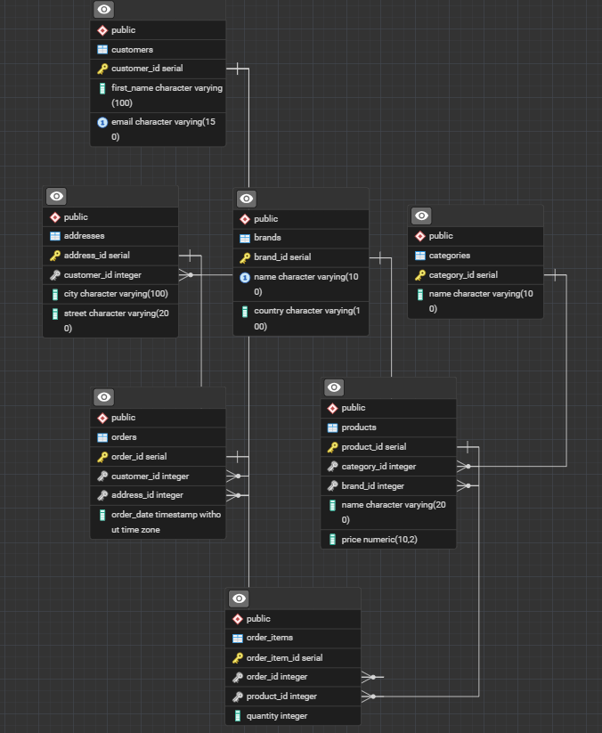

# Лабораторна робота 5: Нормалізація бази даних

---

## 1. Аналіз початкової схеми та виявлення проблем

Під час аналізу схеми бази даних інтернет-магазину (з Лабораторної №2) та спроби її розширення для реальних потреб бізнесу було виявлено таблиці з потенційними аномаліями оновлення та надлишковістю даних. 

Для демонстрації процесу нормалізації розглянемо розширені версії таблиць `customers` (куди спробували додати історію адрес) та `products` (куди додали інформацію про виробника).

### Функціональні залежності (ФЗ) початкової схеми

**Таблиця `products` (Ненормалізована розширена версія):**
Стовпці: `product_id`, `name`, `price`, `brand_name`, `brand_country`
* **ПК (Первинний ключ):** `product_id`
* **ФЗ 1:** `product_id` -> `name`, `price`, `brand_name`, `brand_country`
* **ФЗ 2:** `brand_name` -> `brand_country` (країна залежить від бренду, а не від конкретного товару)

**Таблиця `order_items` (з доданою назвою товару для "зручності"):**
Стовпці: `order_id`, `product_id`, `product_name`, `quantity`
* **Складений ПК:** `(order_id, product_id)`
* **ФЗ 1:** `(order_id, product_id)` -> `quantity`
* **ФЗ 2:** `product_id` -> `product_name`

**Таблиця `customers` (з адресою доставки):**
Стовпці: `customer_id`, `first_name`, `email`, `delivery_addresses` (містить список адрес через кому)
* **ПК:** `customer_id`
* **ФЗ 1:** `customer_id` -> `first_name`, `email`, `delivery_addresses`

---

## 2. Покроковий процес нормалізації

### Крок 1: Перша нормальна форма (1NF)
**Вимога 1NF:** Усі атрибути повинні бути атомарними (неподільними), не має бути масивів або списків у одному полі.

* **Проблема:** У таблиці `customers` поле `delivery_addresses` містить кілька значень (наприклад, "Київ вул. Політехнічна 14, Львів вул. Франка 5"). Це порушує 1NF і створює проблеми при пошуку чи оновленні конкретної адреси.
* **Рішення:** Видалити поле `delivery_addresses` з `customers`. Створити окрему таблицю `addresses`, де кожна адреса буде окремим записом, розбитим на атомарні частини (`city`, `street`).

```sql
-- Перехід до 1NF (Усунення множинних атрибутів)
ALTER TABLE customers DROP COLUMN delivery_addresses;

CREATE TABLE addresses (
    address_id SERIAL PRIMARY KEY,
    customer_id INTEGER REFERENCES customers(customer_id),
    city VARCHAR(100) NOT NULL,
    street VARCHAR(200) NOT NULL
);
```
### Крок 2: Друга нормальна форма (2NF)
**Вимога 2NF:** Таблиця знаходиться в 1NF, і всі неключові атрибути повністю залежать від усього складеного первинного ключа (відсутність часткових залежностей).

* **Проблема:** У таблиці order_items зі складеним ключем (order_id, product_id) атрибут product_name залежить лише від product_id, а не від усього ключа. Це класична часткова залежність, яка призводить до дублювання назв товарів у кожному замовленні.

* **Рішення:** Видалити product_name з деталізації замовлення, оскільки ця інформація вже зберігається в таблиці products.

```sql
-- Перехід до 2NF (Усунення часткової залежності)
ALTER TABLE order_items DROP COLUMN product_name;
```
### Крок 3: Третя нормальна форма (3NF)
**Вимога 3NF:** Таблиця знаходиться в 2NF, і жоден неключовий атрибут не залежить від іншого неключового атрибута (відсутність транзитивних залежностей).

* **Проблема:** У таблиці products атрибут brand_country залежить від brand_name (product_id -> brand_name -> brand_country). Якщо бренд змінить країну реєстрації, доведеться оновлювати тисячі рядків товарів. Також є ризик аномалії вставки (неможливо додати бренд без товару).

* **Рішення:** Декомпозиція. Створюємо окрему таблицю brands і залишаємо в products лише зовнішній ключ brand_id.

```sql
-- Перехід до 3NF (Усунення транзитивної залежності)
CREATE TABLE brands (
    brand_id SERIAL PRIMARY KEY,
    name VARCHAR(100) NOT NULL UNIQUE,
    country VARCHAR(100) NOT NULL
);

ALTER TABLE products DROP COLUMN brand_country;
ALTER TABLE products DROP COLUMN brand_name;
ALTER TABLE products ADD COLUMN brand_id INTEGER REFERENCES brands(brand_id);
```
## 3. Фінальна нормалізована схема бази даних
Після проведення всіх етапів нормалізації база даних відповідає вимогам 3NF. Кожен факт зберігається лише один раз, усунуто ризики аномалій оновлення, видалення та вставки.



```sql
---

### 2. SQL Скрипт `normalized_schema.sql`
Цей скрипт створює ідеальну базу даних у 3NF з нуля. Збережи його у відповідний файл та виконай у pgAdmin.

```sql
-- Лабораторна робота 5: Фінальна схема БД у 3НФ
-- Проект: Інтернет-магазин електроніки

-- Очищення бази перед розгортанням нової схеми
DROP TABLE IF EXISTS order_items CASCADE;
DROP TABLE IF EXISTS orders CASCADE;
DROP TABLE IF EXISTS addresses CASCADE;
DROP TABLE IF EXISTS products CASCADE;
DROP TABLE IF EXISTS brands CASCADE;
DROP TABLE IF EXISTS categories CASCADE;
DROP TABLE IF EXISTS customers CASCADE;

-- 1. Довідник категорій (3NF)
CREATE TABLE categories (
    category_id SERIAL PRIMARY KEY,
    name VARCHAR(100) NOT NULL
);

-- 2. Довідник брендів (Створено для досягнення 3NF - усунення транзитивної залежності)
CREATE TABLE brands (
    brand_id SERIAL PRIMARY KEY,
    name VARCHAR(100) NOT NULL UNIQUE,
    country VARCHAR(100) NOT NULL
);

-- 3. Товари (3NF - жодних транзитивних залежностей)
CREATE TABLE products (
    product_id SERIAL PRIMARY KEY,
    category_id INTEGER REFERENCES categories(category_id) ON DELETE CASCADE,
    brand_id INTEGER REFERENCES brands(brand_id) ON DELETE SET NULL,
    name VARCHAR(200) NOT NULL,
    price NUMERIC(10, 2) NOT NULL CHECK (price > 0)
);

-- 4. Клієнти (3NF - усунено множинні атрибути адрес з 1NF)
CREATE TABLE customers (
    customer_id SERIAL PRIMARY KEY,
    first_name VARCHAR(100) NOT NULL,
    email VARCHAR(150) UNIQUE NOT NULL
);

-- 5. Адреси доставки (Декомпозиція для досягнення 1NF)
CREATE TABLE addresses (
    address_id SERIAL PRIMARY KEY,
    customer_id INTEGER NOT NULL REFERENCES customers(customer_id) ON DELETE CASCADE,
    city VARCHAR(100) NOT NULL,
    street VARCHAR(200) NOT NULL
);

-- 6. Замовлення (3NF)
CREATE TABLE orders (
    order_id SERIAL PRIMARY KEY,
    customer_id INTEGER REFERENCES customers(customer_id) ON DELETE CASCADE,
    address_id INTEGER REFERENCES addresses(address_id) ON DELETE RESTRICT,
    order_date TIMESTAMP DEFAULT CURRENT_TIMESTAMP
);

-- 7. Деталізація замовлення (3NF - усунено часткову залежність product_name з 2NF)
CREATE TABLE order_items (
    order_item_id SERIAL PRIMARY KEY,
    order_id INTEGER REFERENCES orders(order_id) ON DELETE CASCADE,
    product_id INTEGER REFERENCES products(product_id) ON DELETE CASCADE,
    quantity INTEGER NOT NULL CHECK (quantity > 0)
);
```