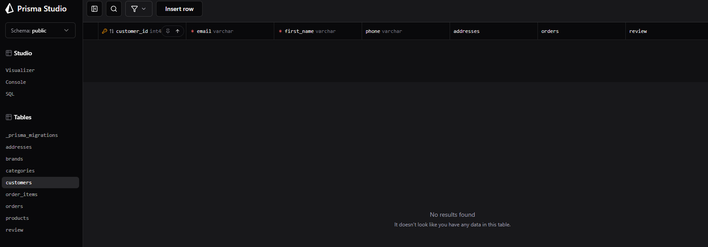
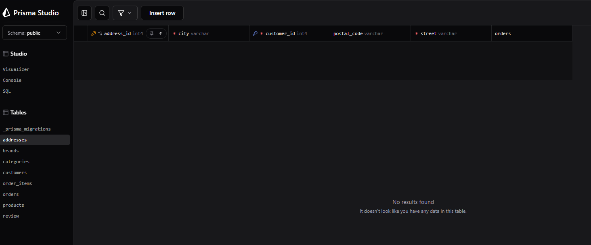
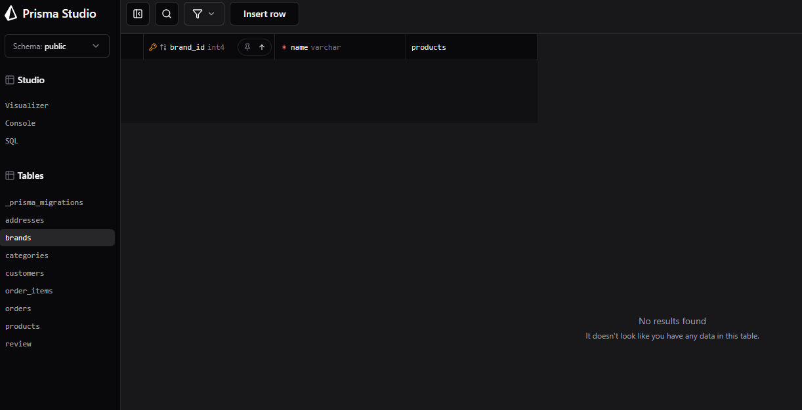
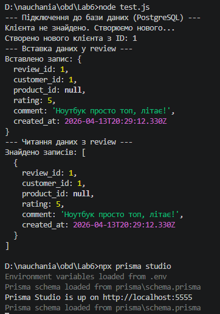
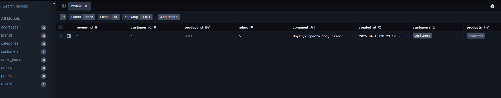

# Міграції

Цей файл документує зміни, внесені до схеми бази даних (`schema.prisma`) в рамках лабораторної роботи для інтернет-магазину електроніки.

## 1. Додавання нової таблиці (Review)

**Опис:**
Створено нову модель `review` для зберігання відгуків покупців. Встановлено зв'язки:
- Один клієнт (`customers`) може мати багато відгуків (`review`).
- Один товар (`products`) може мати багато відгуків (`review`).

**Зміни в `schema.prisma`:**


НОВА МОДЕЛЬ
```sql
model review {
  review_id   Int       @id @default(autoincrement())
  customer_id Int
  product_id  Int?
  rating      Int
  comment     String?
  created_at  DateTime  @default(now()) @db.Timestamp(6)
  customers   customers @relation(fields: [customer_id], references: [customer_id], onDelete: Cascade, onUpdate: NoAction)
  products    products? @relation(fields: [product_id], references: [product_id], onDelete: SetNull, onUpdate: NoAction)
}
```
ОНОВЛЕННЯ ІСНУЮЧИХ МОДЕЛЕЙ
```sql
model customers {
  // ...
  review review[] // Зворотній зв'язок
}

model products {
  // ...
  review review[] // Зворотній зв'язок
}
```
2. Зміна існуючих таблиць (Додавання полів)
Опис:

Клієнти: У модель `customers` додано необов'язкове поле phone для збереження номеру телефону.

Адреси: У модель `addresses` додано необов'язкове поле `postal_code` (поштовий індекс).

Зміни в `schema.prisma`:

Модель `customers`
До:
```sql
model customers {
  customer_id Int           @id @default(autoincrement())
  first_name  String        @db.VarChar(100)
  email       String        @unique @db.VarChar(150)
  // ...
}
```
Після:
```sql
model customers {
  customer_id Int           @id @default(autoincrement())
  first_name  String        @db.VarChar(100)
  email       String        @unique @db.VarChar(150)
  phone       String?       @db.VarChar(20)       // <-- Нове поле
  // ...
}
```

Модель `addresses`
До:
```sql
model addresses {
  // ...
  city        String    @db.VarChar(100)
  street      String    @db.VarChar(200)
  // ...
}
```
Після:
```sql
model addresses {
  // ...
  city        String    @db.VarChar(100)
  street      String    @db.VarChar(200)
  postal_code String?   @db.VarChar(20)           // <-- Нове поле
  // ...
}
```

Зміна реалізована через npx prisma migrate dev, що автоматично створює SQL ALTER TABLE.

3. Видалення стовпця
Опис:
Видалено поле country з моделі `brands`, оскільки прив'язка бренду до однієї країни більше не відповідає бізнес-логіці магазину (багато брендів є транснаціональними).

Зміни в `schema.prisma`:

До:
```sql
model brands {
  brand_id    Int        @id @default(autoincrement())
  name        String     @unique @db.VarChar(100)
  country     String     @db.VarChar(100)         // <-- Поле для видалення
  products    products[]
}
```
Після:
```sql
model brands {
  brand_id    Int        @id @default(autoincrement())
  name        String     @unique @db.VarChar(100)
  // Поле country видалено
  products    products[]
}
```

4. Перевірка роботи схеми
Для перевірки коректності змін у базі даних було написано скрипт на Node.js (test.js), який підключається до бази даних PostgreSQL за допомогою Prisma Client, створює тестового клієнта та додає відгук.

Результат виконання тесту:





Цей тест підтверджує, що:

Таблиця review успішно створена в базі даних.

Зв'язки (Foreign Keys) між review та customers працюють коректно.

Операції запису та читання через Prisma Client виконуються без помилок.